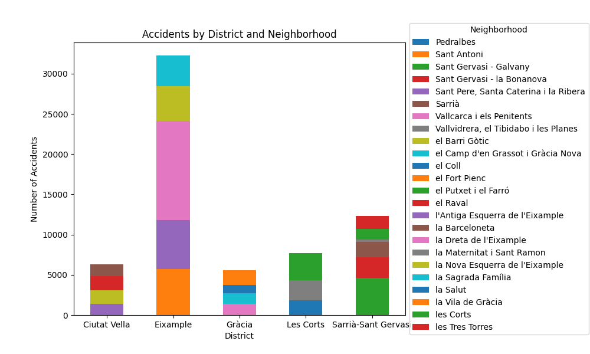

# VD - PAC2

## Stacked Bar Chart

El joc de dades fet servir es pot consultar a [Kaggle](https://www.kaggle.com/datasets/emmanuelfwerr/barcelona-car-accidents).

Consisteix en un joc de dades que conté tots els accidents de tràfic de Barcelona classificats per districte, barri, data, etc. Jo personalment he agafat un subconjunt de districtes per a facilitar la visualització de dades i seguir traient conclusions interessants. El subconjunt és: "Ciutat Vella", "Eixample", "Gràcia", "Les Corts" i "Sarrià-Sant Gervasi".

## Candlestick Chart

El joc de dades fet servir es pot consultar a [Kaggle](https://www.kaggle.com/datasets/kaushiksuresh147/top-10-cryptocurrencies-historical-dataset) bitcoin.csv.

Aquest joc de dades està preparat per a fer anàlisi de "trading" i ve classificat per dates amb els paràmetres claus per a fer un gràfic d'espelmes japoneses.

## Marimekko Chart

El joc de dades fet servir es pot consultar a [Kaggle](https://www.kaggle.com/datasets/georgescutelnicu/top-100-popular-movies-from-2003-to-2022-imdb).

El joc de dades tracta del top 100 de pel·lícules a IMDB des de 2003 fins a 2022. Jo he agafat els gèneres per a poder visualitzar quins són els gèneres que predominen en les pel·lícules més populars.

